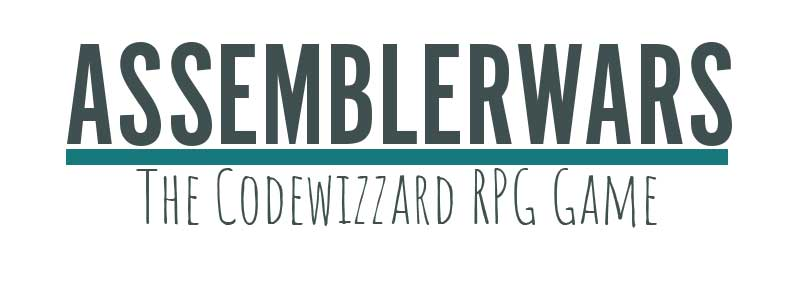
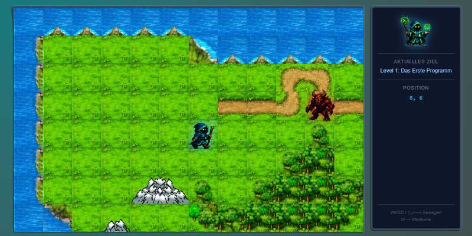
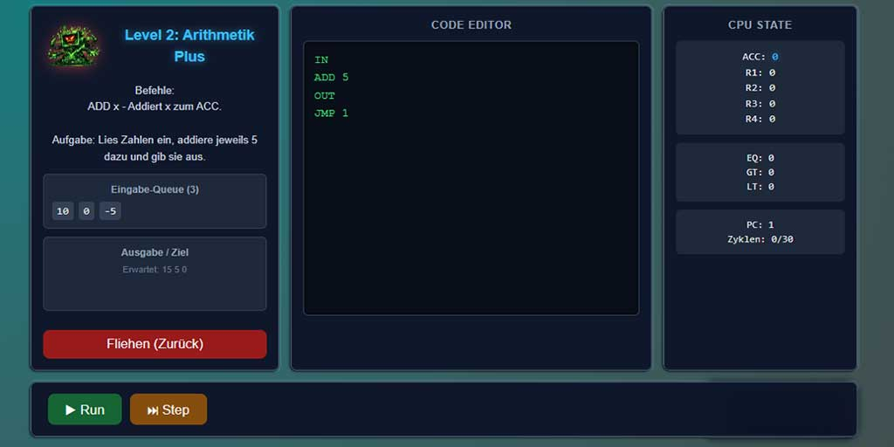

Ein Browser-basiertes Assembly-Lern-RPG.

Du bist der Held und musst böse Bossgegener durch Assembler Code besiegen.

## Features

- Overworld mit verschiedenen Gebieten
- Verschiedene Gegner mit unterschiedlichen Fähigkeiten
- Assembler-Editor mit Syntax-Highlighting
- Debugger mit Breakpoints

## Zustand

Absolut alpha Zustand. Es funktioniert im Prinzip, aber es ist noch nicht fertig. Es wurde als kleines Beispiel für das Spielerische herangehen an Assembler gedacht.

Es werden aktuell googlefonts von googelservern importiert.